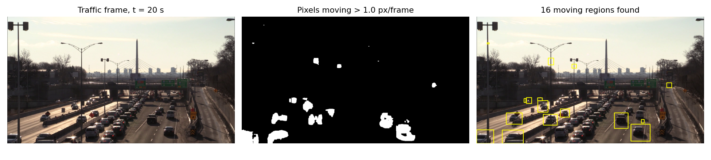
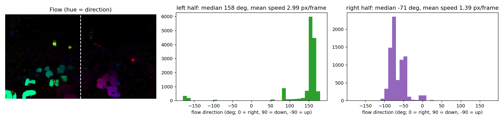
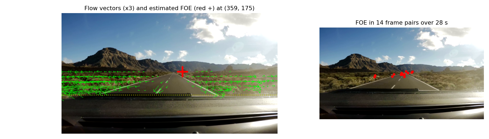
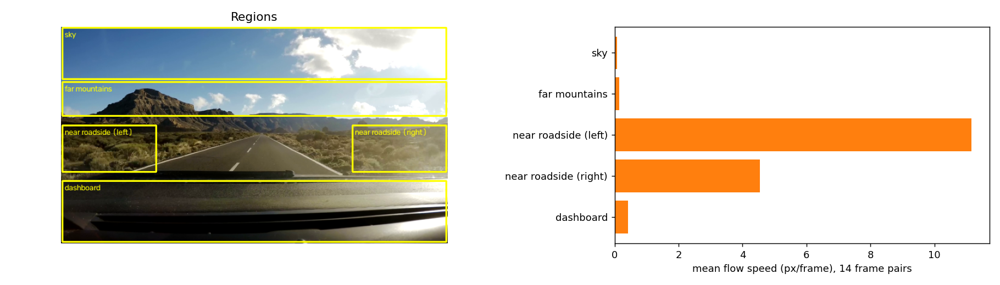
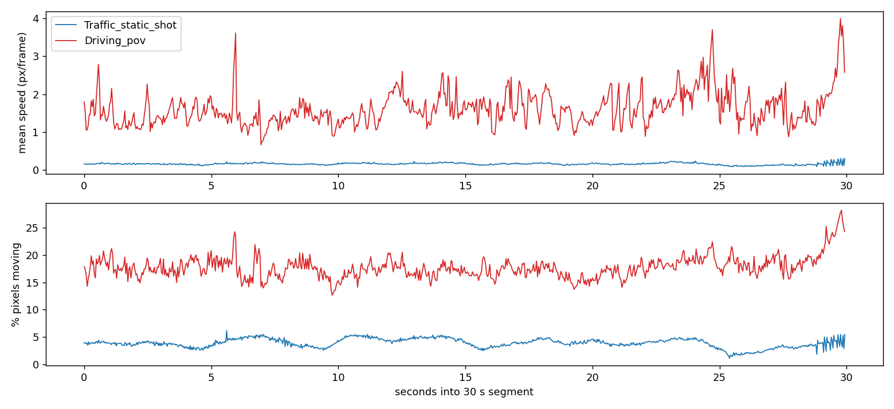
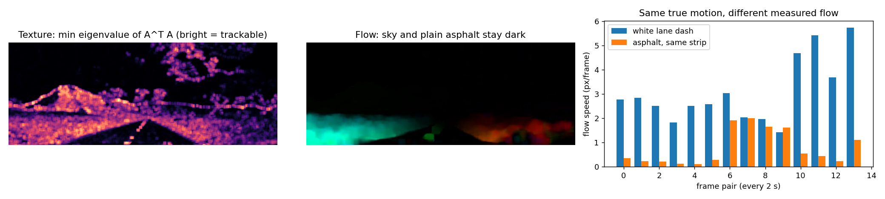

# Part A.1: What optical flow tells us

I computed dense optical flow (Farnebäck, OpenCV) on two 30-second segments at
half resolution:

| Video | Segment | Size, frame rate | Camera |
|---|---|---|---|
| Traffic_static_shot.mp4 | 0:05 to 0:35 | 960×540, 29.97 fps | fixed on an overpass |
| Driving_pov.mp4 | 0:10 to 0:40 | 640×360, 25 fps | dashcam in a moving car |

The flow videos show three panels: the original frame, the flow in HSV (hue
encodes direction, brightness encodes speed), and the flow as arrows.
`flow_analysis.py` produces every figure and number below; `figures/analysis_numbers.txt`
logs the raw values.

## 1. Which pixels move: segmentation for free

With a fixed camera, the background has zero flow, so any pixel moving more than
1 px/frame belongs to a moving object. At t = 20 s, 4.15% of the traffic frame
passes that threshold. Grouping those pixels into connected regions gives 14
moving regions, and the regions sit on the cars (Figure 1).

*Figure 1. Traffic video: thresholding the flow magnitude separates moving cars
from the road, sky and bridge.*

The mask marks motion. A car stopped in the jam on the right disappears from it,
and a few small specks near the skyline come from noise in static pixels.

## 2. Direction and speed of each object

The flow vector at a pixel gives the direction and speed of its image motion. In
the traffic video, I split the frame at the median strip and plotted the
direction of every moving pixel (Figure 2).

*Figure 2. The two carriageways produce two separate direction peaks.*

- **Left carriageway:** median direction 158°, leftward with a small downward
  component, so these cars approach the camera. Mean speed 2.98 px/frame.
- **Right carriageway:** median direction −72°, up the image, so these cars drive
  away from the camera. Mean speed 1.39 px/frame.

The flow alone tells you the two lanes carry traffic in opposite directions, and
that the right side moves at half the image speed of the left. The packed lanes
on the right agree with that reading. Pixel speed depends on distance as well as
true speed, so a car near the bottom of the frame shows more px/frame than an
identical car near the horizon. To convert to km/h you would need the camera
calibration and the road geometry.

## 3. How the camera moves: the focus of expansion

When the camera translates forward, every scene point flows outward along a line
from one image point: the **focus of expansion** (FOE), which marks the direction
of travel. Each flow vector **d** at pixel **p** defines a line through **p**. With
the unit normal **n** = (−d_y, d_x)/|**d**|, any point **x** on that line satisfies
**n**·**x** = **n**·**p**. Stacking one row per moving pixel gives an overdetermined
system, and least squares returns the point closest to every line.

*Figure 3. Left: flow vectors and the estimated FOE at t = 25 s. Right: the FOE
in 14 frame pairs spread over the segment.*

- At t = 25 s the FOE lands at (359, 175), on the horizon above the road, and
  98.6% of the vectors point away from it. That confirms forward motion.
- Across 14 frame pairs, the FOE height stays within a standard deviation of
  6.9 px. Its horizontal position varies more (std 44 px). Two causes contribute:
  the road curves, which turns the heading, and the vectors near the horizon run
  close to horizontal, which pins down the FOE height better than its left-right
  position.

The traffic video shows no FOE: its background flow is zero, which tells you the
camera stays still. The flow field separates camera motion from object motion.

## 4. Relative depth from parallax

For a camera moving straight ahead, a point at depth Z and image distance r from
the FOE moves at a speed proportional to r/Z. Near objects move fast and far
objects move little. Figure 4 averages the flow speed in five regions over 14
frame pairs.

*Figure 4. Mean flow speed per region in the driving video.*

| Region | Mean speed (px/frame) |
|---|---|
| Sky | 0.07 |
| Far mountains | 0.14 |
| Near roadside, right | 4.54 |
| Near roadside, left | 11.16 |
| Dashboard | 0.42 |

The roadside bushes move 30 to 80 times faster than the mountains, which ranks
them as much closer. The left box sits lower in the frame and farther from the FOE
than the right box, so its larger r gives it the higher speed. The dashboard
travels with the camera, so it reads near zero; its 0.42 px/frame comes from
vibration and reflections on the plastic.

## 5. Scene activity over time

Figure 5 plots two numbers per frame for both videos: mean flow speed and the
percentage of pixels moving above 1 px/frame.

*Figure 5. Flow statistics over each 30-second segment.*

| Video | Mean speed (px/frame) | Pixels moving |
|---|---|---|
| Traffic | 0.16 (range 0.09 to 0.31) | 3.9% (range 1.1 to 6.2) |
| Driving | 1.62 (range 0.66 to 3.99) | 17.7% (range 12.7 to 28.2) |

The traffic curve stays flat because a steady stream of cars crosses a still
background. The driving curve sits ten times higher and spikes when the car hits
bumps, since a bump shakes the whole frame at once. These two numbers alone would
let you classify a clip as "fixed camera" or "moving camera."

## 6. Where optical flow fails

Flow needs texture. The tracking derivation in the next section shows that each
window yields a 2×2 system with matrix AᵀA built from image gradients. In a
uniform region, AᵀA has near-zero eigenvalues and the system has no reliable
solution: the aperture problem.

To isolate texture from geometry, I compared two sets of pixels in one narrow
strip around the centre lane line, in the same rows: the white dashes and the
plain asphalt beside them. Both lie on the road surface at the same depth and the
same distance from the FOE, so they share the same true motion.

*Figure 6. Left: texture score (smallest eigenvalue of AᵀA). Centre: flow; the sky
and plain asphalt stay dark. Right: flow on dashes and on asphalt in the same strip.*

Across 14 frame pairs, the dashes average 3.08 px/frame and the asphalt
0.78 px/frame. The asphalt reads lower in 13 of the 14 pairs. Farnebäck smooths
the field, so the textureless asphalt inherits small values instead of its true
motion. The sky shows the same effect (0.07 px/frame). Its near-zero reading
comes from distance and from a lack of texture together, so you cannot separate
the two causes from the flow alone.

## Summary

From the flow I can recover:

1. which pixels move (segmentation, Figure 1)
2. direction and image speed per object, enough to tell opposing lanes apart (Figure 2)
3. whether the camera moves, and its heading through the FOE (Figure 3)
4. relative depth through parallax (Figure 4)
5. overall scene activity over time (Figure 5)

The flow breaks down in textureless regions, where the image gives no gradient to
measure (Figure 6).
